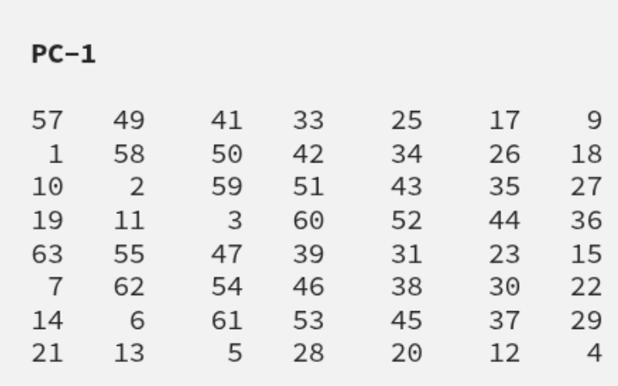
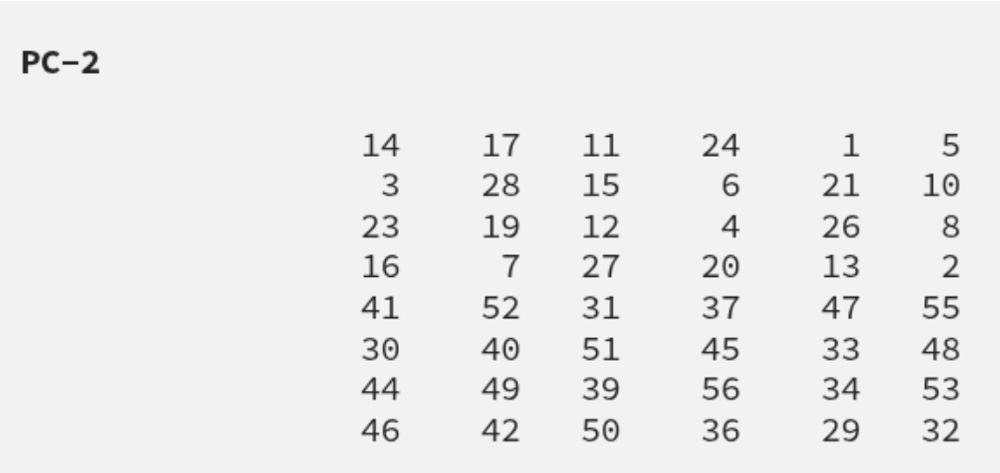
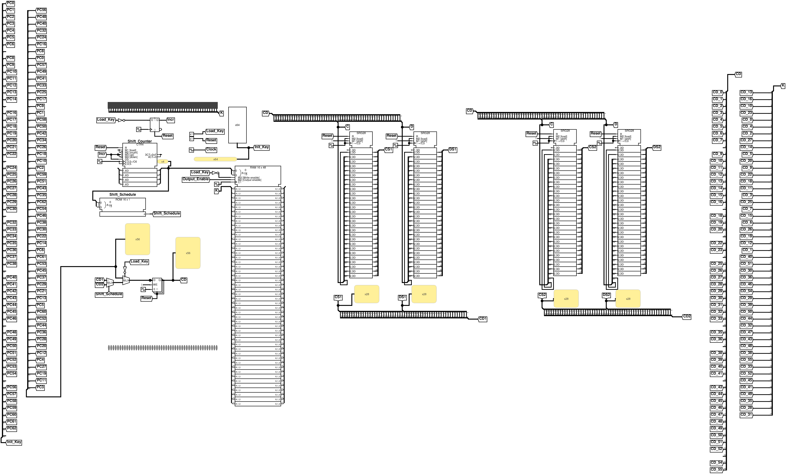
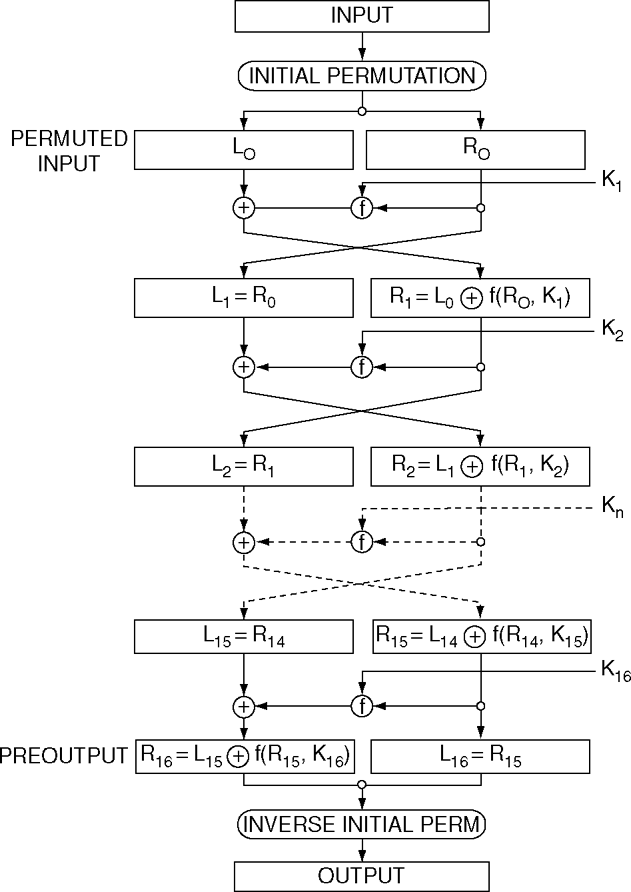

# DES Implementation in Logisim Evolution

  

This README provides an overview of the **Data Encryption Standard (DES)** algorithm, its key schedule and encryption rounds.

1. [Introduction](#introduction)

2. [DES Structure Overview](#des-structure-overview)

3. [Key Scheduling](#key-scheduling)

  

    * [PC-1 Permutation](#pc-1-permutation)

    * [C/D Shifts](#cd-shifts)

    * [PC-2 Permutation](#pc-2-permutation)

4. [Encryption Rounds (Feistel Network)](#encryption-rounds-feistel-network)

6. [References](#references)

  

---

  

## Introduction

  

The **Data Encryption Standard (DES)** is a symmetric-key algorithm for the encryption of digital data. Developed in the 1970s, DES became a widely adopted standard for secure communications. Although superseded by more modern algorithms (like AES), DES remains an excellent educational tool to learn about block ciphers and Feistel networks.

  

---

  

## DES Structure Overview

  

* **Block size:** 64 bits

* **Key size:** 64 bits (56 bits used; 8 bits for parity)

* **Rounds:** 16 Feistel rounds

  

At a high level, DES encryption consists of:

  

1. Initial Permutation (IP)

2. 16 rounds of the Feistel function

3. Final Permutation (IP-1)

  

---

  

## Key Scheduling

  

The DES key schedule generates **16 round keys** (48 bits each) from the original 64-bit key.

  

### PC-1 Permutation

  

* Input: 64-bit key (including parity bits)

* Output: 56-bit key (parity bits dropped, bits permuted)

  

  

### C/D Shifts

  

* Split the 56-bit result into two 28-bit halves: **C** and **D**.

* Perform circular left shifts on each half according to the DES shift schedule:

  

| Round | Shifts |

| ----------- | ------ |

| 1, 2, 9, 16 | 1 bit |

| All others | 2 bits |

  

  

### PC-2 Permutation

  

* Input: 56-bit concatenation of shifted C/D

* Output: 48-bit round key

  

  

  

---
## Logisim key schedule diagram

  

## Encryption Rounds (Feistel Network)

  

Each round applies the following steps:

  

1. Expand the right half (32 → 48 bits)

2. XOR with the round key

3. Substitute via 8 S-boxes (48 → 32 bits)

4. Permutate (P-box)

5. Swap halves (except after final round)

  

  

  

---

  

## References

  

* FIPS PUB 46-3: Data Encryption Standard

* Schneier, B. (1996). *Applied Cryptography*

* [Data Encryption Standard (DES): Encryption by Christof Paar](https://www.youtube.com/watch?v=kPBJIhpcZgE)

* [Data Encryption Standard (DES): Key Schedule and Decryption by Christof Paar](https://www.youtube.com/watch?v=l-7YW06BFNs)

  

---